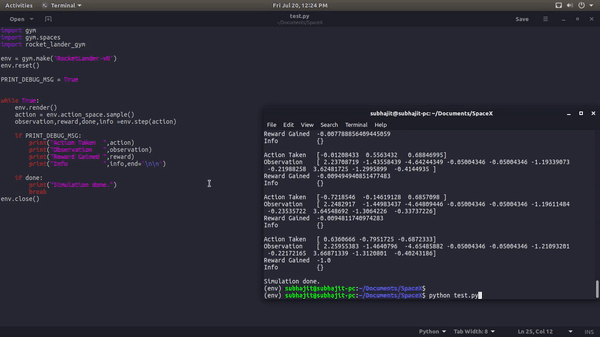
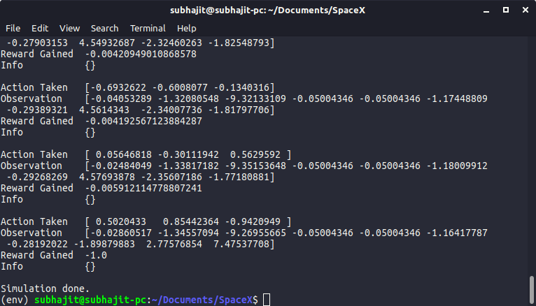

# Rocket Lander Gym

This is an [OpenAI](https://github.com/openai) [gym](https://github.com/openai/gym) custom environment. It simulates SpaceX Falcon Rocket landing. I have not created this environment, this environment was orginally created by [Sven Niederberger](https://github.com/EmbersArc) check the orginal work [here](https://github.com/EmbersArc/gym). I have just seperated the environment from the orginal source and converted it into a installable package following the guidelines from [here](https://github.com/openai/gym/blob/master/gym/envs/README.md). 

Why I did this ?
Well I wanted to try out this environment but the procedure was not very clear in the original source. Moreover [here](https://github.com/EmbersArc/gym) the environment was fused with the OpenAI gym repository so I decided to seperate them so that people who already have gym installed or are using newer version of gym can use this environment. This repository will also provide easy access to this environment.

[Click here for higher quality video](https://gfycat.com/CoarseEmbellishedIsopod) 

 

## Getting Started

These instructions will get you the environment up and running on your local machine for development purposes. See [FAQ](FAQ.md) section for problems with installation or running.

### Prerequisites
Things you need to install before installing this project.Please install them before hand it is very important. 

```
gym, pybox2d
```
 This project heavily depends on OpenAI gym and Box2d so please install them before hand otherwise you might encounter error. A full installation of [gym](https://github.com/openai/gym) is recommended. A quick look over [FAQ](FAQ.md) section is recommended because of some problems with installation of Box2d.
### Installing

A step by step series of how to get a development environment running.
You can use also virtual environment for conflicting dependencies.I personally use [virtualenv](https://virtualenv.pypa.io/en/stable/) for more information look [here](https://github.com/pypa/virtualenv) 

First install gym

```
pip install gym
```

and now the custom environment

```
git clone https://github.com/Jeetu95/Rocket_Lander_Gym.git
cd Rocket_Lander_Gym/
pip install .

```
### Testing out the environment

Now to test whether the environment is working or not run the following code.

###### Note :- The image above is a trained model what you get in this repository is not a trained model but only the gym environment.

```
import gym
import gym.spaces
import rocket_lander_gym

env = gym.make('RocketLander-v0')
env.reset()

PRINT_DEBUG_MSG = True


while True:
    env.render()
    action = env.action_space.sample()
    observation,reward,done,info =env.step(action)

    if PRINT_DEBUG_MSG:
        print("Action Taken  ",action)
        print("Observation   ",observation)
        print("Reward Gained ",reward)
        print("Info          ",info,end='\n\n')

    if done:
        print("Simulation done.")
        break
env.close()
```
To ommit out the debug messages change ***PRINT_DEBUG_MSG*** to ***False***

## Details About The Project

The objective of this environment is to land a rocket on a ship. The environment is highly customizable and takes discrete or continuous inputs.

### STATE VARIABLES  
The state consists of the following variables:
- x position  
- y position  
- angle  
- first leg ground contact indicator  
- second leg ground contact indicator  
- throttle  
- engine gimbal  
  
If VEL_STATE is set to true, the velocities are included:  
- x velocity  
- y velocity  
- angular velocity  
  
All state variables are normalized for improved training.
    
### CONTROL INPUTS  
Discrete control inputs are: 
- gimbal left  
- gimbal right  
- throttle up  
- throttle down  
- use first control thruster  
- use second control thruster  
- no action  
    
Continuous control inputs are:  
- gimbal (left/right)  
- throttle (up/down)  
- control thruster (left/right)  

 
 

## Authors

* **Sven Niederberger** - *Initial work* - [Sven Niederberger](https://github.com/EmbersArc)
* **Subhajit Das** - *Wrapping up work* - [Subhajit Das](https://github.com/J)

## License

This project is licensed under the MIT License - see the [LICENSE](LICENSE.md) file for details